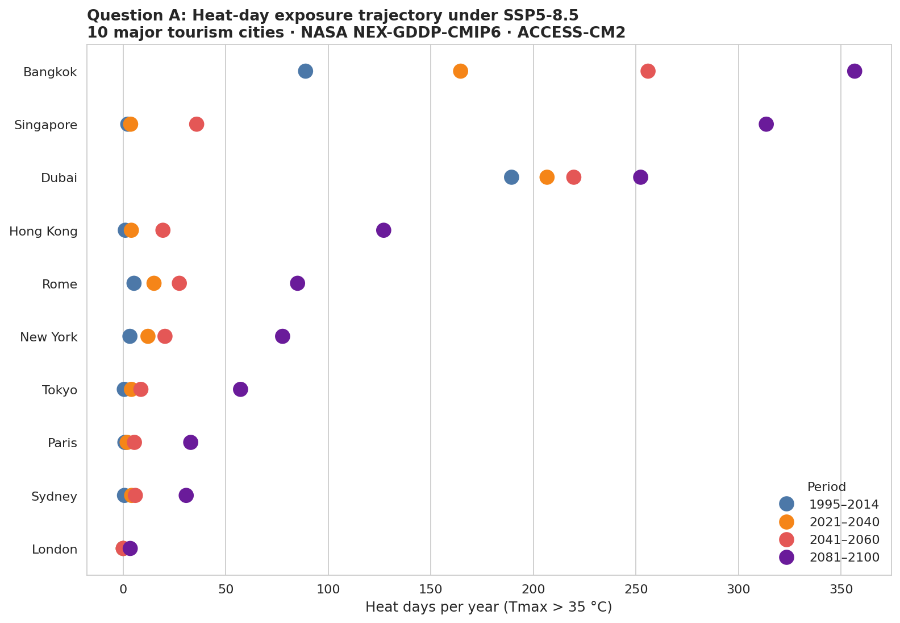
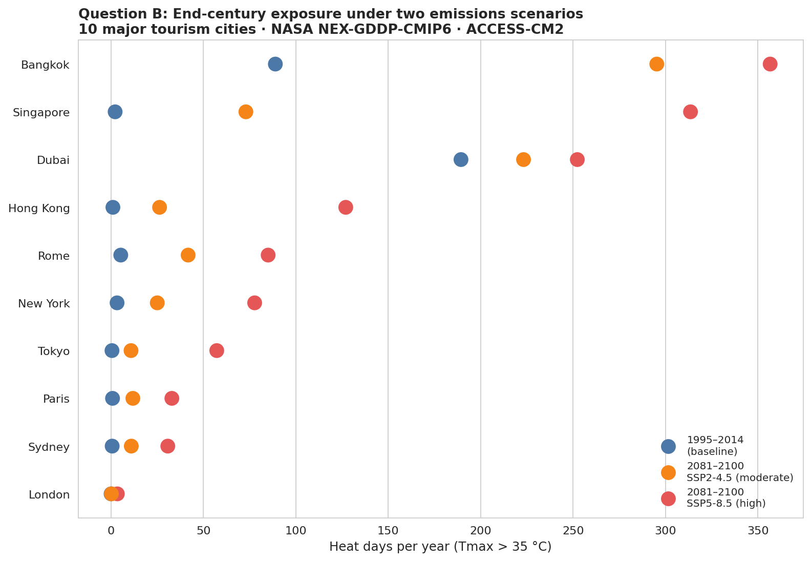

# Tourism Heat Exposure under NASA CMIP6 Climate Projections

A scoping analysis of projected extreme heat exposure for 10 major global tourism cities, using NASA NEX-GDDP-CMIP6 daily downscaled climate projections.

**Author:** Hanem Ellethy, PhD · Brisbane, QLD · 2026

## Context

This repository was prepared in support of an application for the Research Fellow position on the ARC Discovery Project *Extreme Heat in Cities: Co-Developing Just Adaptation for Urban Tourism* (DP260101699), Griffith Institute for Tourism.

The notebook prototypes an end-to-end pipeline for the kind of analysis the project requires: ingesting NASA's high-resolution climate projections, sampling them at major tourism destinations, computing a heat-exposure metric relevant to visitor health, and visualising change across IPCC time horizons and emissions scenarios.

## Note on scope and intent 
Climate science and tourism are new domains for me, my background is in clinical AI. When I read the project description and saw that NEX-GDDP-CMIP6 is publicly available, I wanted to explore it directly: the methodological core of the project, integrating multi-source spatial-temporal data into predictive frameworks, is the work I have done throughout my PhD and post-doctoral career, applied to a domain I find compelling.

This scoping analysis is offered not as proof of domain expertise, which I don't yet have, but as evidence of how I would approach the project: by getting into the data quickly, being honest about limitations, and building methodological scaffolding that the substantive experts on the team can refine. The analytical reflex transfers; the domain knowledge I would learn under mentorship, as the position description envisages.

## Questions addressed

The analysis answers two distinct questions:

- **Question A — Trajectory:** When does extreme heat arrive at each destination under continued high emissions?
- **Question B — Mitigation sensitivity:** How much of the projected heat burden is avoidable through emissions reduction?

## Method

| Component | Choice |
|---|---|
| Climate data | NASA NEX-GDDP-CMIP6 (Thrasher et al., 2022), via Google Earth Engine |
| Spatial resolution | 0.25° (~25 km) |
| Cities | 10 major destinations spanning 5 world regions and 4 climate zones |
| Metric | Heat days per year (daily Tmax > 35 °C) |
| Model | ACCESS-CM2 (single-model scoping; multi-model ensemble is a planned extension) |
| Horizons | Baseline 1995–2014; near-term 2021–2040; mid-century 2041–2060; end-century 2081–2100 |
| Scenarios | SSP2-4.5 (moderate), SSP5-8.5 (high) |

**City selection.** Ten cities were sampled to span five world regions (Europe, Asia Pacific, North America, Middle East, Australasia) and four climate zones (temperate, tropical, subtropical, arid), drawing from destinations that appear consistently in the top tier of major tourism indices including Euromonitor's *Top 100 City Destinations* and Mastercard's *Global Destination Cities*. A full ARC-scale study would extend to the formally ranked Top 100.

## Question A — When does the heat arrive?

The trajectory reveals three city archetypes:

- **Trajectory toward saturation** (Bangkok, Singapore) — destinations whose end-century exposure under SSP5-8.5 reaches 85–98% of the year, regardless of where they started. Bangkok already sits at one-quarter of the year; Singapore starts at near-zero. Both end nearly fully saturated.

- **Already-exposed, slowly worsening** (Dubai) — already on heat days for over half the year today; trajectory is comparatively flat (+63 days from baseline to end-century). Dubai's challenge is sustained extreme exposure rather than acceleration.

- **Tipping-point destinations** (Hong Kong) — modest current exposure (~1 day/year today) but a steep end-century jump to ~127 days. Crosses thresholds that fundamentally change the city's heat regime.

- **Moderate increase** (Rome, New York, Tokyo, Paris, Sydney) — meaningful absolute increases (30–85 extra days/year) but well below saturation.

- **Minimal change** (London) — temperate maritime climate; even end-century projections leave heat days near zero.

Each archetype implies a different adaptation pathway — a framing that directly motivates the *just adaptation* question at the heart of the host ARC project.

## Question B — Does mitigation matter?

The difference between SSP2-4.5 and SSP5-8.5 dots is the **emissions premium**: heat-day burden that effective climate policy could plausibly avert for each destination.

### Emissions premium by city

| City | Region | Baseline | SSP2-4.5 (2090) | SSP5-8.5 (2090) | Avoided by moderate policy |
|---|---|---:|---:|---:|---:|
| Singapore | Asia Pacific | 2.2 | 73.0 | 313.6 | **+240.6** |
| Hong Kong | Asia Pacific | 1.0 | 26.2 | 127.0 | **+100.8** |
| Bangkok | Asia Pacific | 88.9 | 295.3 | 356.6 | +61.3 |
| New York | North America | 3.2 | 25.0 | 77.7 | +52.7 |
| Tokyo | Asia Pacific | 0.5 | 10.8 | 57.2 | +46.4 |
| Rome | Europe | 5.2 | 41.7 | 85.0 | +43.3 |
| Dubai | Middle East | 189.4 | 223.2 | 252.3 | +29.1 |
| Paris | Europe | 0.8 | 11.8 | 32.9 | +21.1 |
| Sydney | Australasia | 0.6 | 11.0 | 30.7 | +19.8 |
| London | Europe | 0.0 | 0.2 | 3.4 | +3.2 |

### A subtle but important pattern

The emissions premium is not simply a function of how hot a city becomes — it is a function of *where the city sits relative to saturation*:

- **Singapore** (+241 days avoidable) sits below the 35 °C threshold under moderate emissions but is pushed firmly above it under high emissions. Mitigation matters enormously here.
- **Bangkok** (+61 avoidable) already reaches 295 days/year under moderate emissions; even successful mitigation leaves it functionally in heat extremes most of the year.
- **Dubai** (+29 avoidable) is approaching the 365-day physical ceiling under any scenario.

**Policy implication.** Cities split into two archetypes for adaptation strategy: *mitigation-responsive* destinations (Singapore, Hong Kong, temperate Europe) where global mitigation is the most impactful intervention, and *adaptation-mandatory* destinations (Bangkok, Dubai) where mitigation alone is insufficient and adaptation becomes essential regardless of emissions pathway. This bifurcation is a substantive finding for the host project's framing of equitable urban heat response.

## Reproducing

Open `tourism_heat_eda.ipynb` in Google Colab (or any Jupyter environment with `earthengine-api`), authenticate to Earth Engine, and run all cells. Total runtime: ~15 minutes.

## Limitations and proposed extensions

This is a deliberately scoping analysis. A full ARC-scale study would extend it with:

1. **Multi-model ensemble** (5–30 CMIP6 models) with median and 10–90 percentile bounds. ACCESS-CM2 runs slightly warm over tropical regions, so the absolute magnitudes reported here are likely on the high end of plausible projections.
2. **Intra-city resolution** via Landsat-8 / ECOSTRESS land surface temperature for urban heat island layers — the 0.25° grid cannot resolve UHI signals of 2–8 °C within a city.
3. **Humidity-aware indices** (Wet Bulb Globe Temperature) rather than dry-bulb threshold counts; humidity-driven heat stress is a separate, equally important pathway, especially for tropical destinations.
4. **Bias correction** against Bureau of Meteorology and equivalent local-station records.
5. **Visitor-flow weighting** so exposure integrates over arrival seasonality rather than uniform annual averages.
6. **Public-health utilisation linkage** mapping projected exposure onto expected visitor health-service demand using historical heat–admissions dose-response relationships.

Each extension is methodologically straightforward; this scoping analysis demonstrates the underlying pipeline.

## Data and code license

- NEX-GDDP-CMIP6: CC0 (NASA)
- This repository: MIT

## Reference

Thrasher, B., Wang, W., Michaelis, A., Melton, F., Lee, T., Nemani, R. (2022). NASA Global Daily Downscaled Projections, CMIP6. *Scientific Data* 9, 262. https://doi.org/10.1038/s41597-022-01393-4
